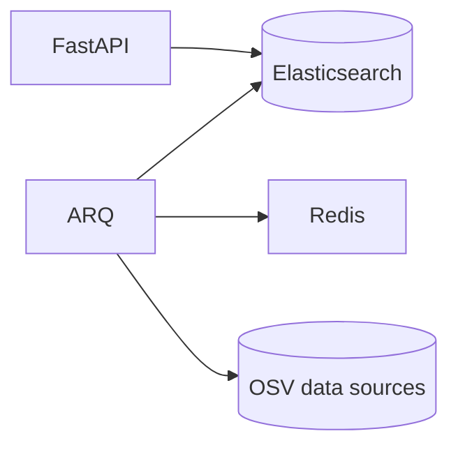

# mihama

An [osv.dev](https://osv.dev/) clone for on-premise usage with extra features.

## Why?

[google/osv.dev](https://github.com/google/osv.dev) is an OSS project. But it's tightly coupled with GCP. This makes it difficult for a non-GCP user is difficult to deploy their own osv.dev in their premise.

## Overview

- Elasticsearch as a database
- FastAPI as an backend API
- ARQ as a job queue (for periodic OSV data updates)
  - Redis is required to run ARQ.
- OSV data sources:
  - [google/osv.dev](https://github.com/google/osv.dev)
  - [ossf/malicious-packages](https://github.com/ossf/malicious-packages)

## Extra Features

- Query by [CycloneDX](https://cyclonedx.org/) SBOM
- Query by [SPDX](https://spdx.dev/) SBOM

## Known Limitations

- Query by `commit` is not supported.

## Docs

- [Installation](https://github.com/ninoseki/mihama/wiki/Installation)
- [CLI](https://github.com/ninoseki/mihama/wiki/CLI)
